# Knowledge Graph pre-processing of existing chapter(s)

1. Source: https://ariadnes-string.livejournal.com/30949.html
2. Preposting: The following is a sample output from one of the reasoning model after analyzing the story (before prediction the next chapter; same can be applied to predicted chapter).  If you couldn't see the diagram, try open it inside Github Online Editor, or mermaidchart.com.
3. Objective: This one demonstrates Time Lines (Scenes/plots):
4. Viz (backup, Github failing to render large mermaid diagram right now):

```mermaid
graph TD
    %% --- Timeline: Sunday Afternoon ---
    subgraph SundayAfternoon_Rain
        %% Scenario: Sunday Afternoon - XL's Apartment Entryway/Living Area %%
        direction TB
        XL1["Xie Lian (Wet, Laughing, Anxious about apartment state)"]
        HC1["Hua Cheng (Wet, Laughing, Observant, Concerned)"]
        Apartment1["XL's Apartment (Humble, Small, Limited furniture)"]
        Boots1["Boots (Wet, Leather, HC's)"]
        Slippers1["Slippers (XL provides for HC)"]

        XL1 -- "Enters with" --> HC1;
        HC1 -- "Stays in" --> Apartment1;
        HC1 -- "Tugs off" --> Boots1;
        XL1 -- "Provides" --> Slippers1;
        HC1 -- "Puts on" --> Slippers1;
        HC1 -- "Dries hair of" --> XL1;

        %% Plot: Caught in rain, HC enters XL's apartment for the first time. Initial intimacy and HC's observation of XL's living situation. %%
        %% Outcome: Increased closeness, HC subtly notes XL's financial struggles. XL feels anxious but cared for. %%
    end

    %% --- Timeline: Sunday Afternoon/Evening ---
    subgraph SundayEvening_Bedroom
        %% Scenario: Sunday Evening - XL's Bedroom %%
        direction TB
        XL2["Xie Lian (Slightly embarrassed, Downplaying)"]
        HC2["Hua Cheng (Observant, Concerned/Judgmental look, Gentle w/ cat)"]
        Mattress1["Mattress (On floor, No frame)"]
        Ruoye1["Ruoye (XL's Cat, Friendly)"]
        Clothes1["Dry Clothes (XL provides for HC)"]

        XL2 -- "Leads to" --> HC2;
        HC2 -- "Enters" --> Bedroom_Location["Bedroom Area"];
        HC2 -- "Notices" --> Mattress1;
        XL2 -- "Explains lack of" --> Bedframe_Concept["Bed Frame"];
        XL2 -- "Offers" --> Clothes1;
        HC2 -- "Pets / Thanks" --> Ruoye1;
        XL2 -- "Feels overwhelmed by affection for" --> HC2;

        %% Plot: HC sees the mattress on the floor, questioning the lack of a frame. HC interacts gently with Ruoye. XL offers food. %%
        %% Outcome: HC's concern about XL's living standard deepens. XL feels affection but slightly ashamed. Foundation laid for HC's later actions. %%
    end

    %% --- Timeline: Weeks Later - Night ---
    subgraph Later_LateNightWork
         %% Scenario: Weeks Later - Phone Call / XL's Apartment (HC visits alone) %%
        direction TB
        XL3["Xie Lian (Working late, Tired, Worried about Ruoye)"]
        HC3["Hua Cheng (Concerned, Caring, Reliable)"]
        Ruoye2["Ruoye (Needs feeding)"]
        Phone1["Phone (Cracked screen)"]
        SpareKey1["Spare Key (Hidden in flowerpot -> Given to HC)"]
        Note1["Note (Food offer, Sweet message, HC's drawing)"]
        Food1["Dinner (Wonton soup etc., Provided by HC)"]
        Apartment2["XL's Apartment (HC enters alone)"]

        XL3 -- "Calls via" --> Phone1;
        Phone1 -- "Connects to" --> HC3;
        XL3 -- "Asks favor feed Ruoye" --> HC3;
        HC3 -- "Worries about" --> XL3;
        XL3 -- "Gives location of" --> SpareKey1;
        HC3 -- "Agrees / Takes" --> SpareKey1;
        HC3 -- "Uses key to enter" --> Apartment2;
        HC3 -- "Feeds" --> Ruoye2;
        HC3 -- "Leaves" --> Food1;
        HC3 -- "Leaves" --> Note1;
        XL3 -- "Returns late to find" --> Food1;
        XL3 -- "Finds / Reads" --> Note1;
        XL3 -- "Keeps / Treasures" --> Note1;

        %% Plot: XL works late, asks HC to feed Ruoye. HC shows concern, brings dinner, gets spare key. %%
        %% Outcome: Increased trust, HC takes on a caretaking role. XL deeply touched by HC's thoughtfulness. HC now has access. %%
    end

    %% --- Timeline: Another Evening ---
    subgraph Later_HCVulnerable
        %% Scenario: Another Evening - XL's Apartment (HC seeks comfort) %%
        direction TB
        XL4["Xie Lian (Welcoming, Concerned, Supportive)"]
        HC4["Hua Cheng (Tired, Vulnerable, Sad about student)"]
        Apartment3["XL's Apartment (HC lets himself in)"]
        Slippers2["Slippers (Ready for HC)"]
        Leftovers1["Leftovers (XL provides)"]
        PastStruggles_HC["HC's Past Struggles (Shared vulnerability)"]

        HC4 -- "Uses key to enter" --> Apartment3;
        XL4 -- "Finds / Worries about" --> HC4;
        XL4 -- "Helps with boots / Provides" --> Slippers2;
        XL4 -- "Offers" --> Leftovers1;
        HC4 -- "Eats mechanically" --> Leftovers1;
        HC4 -- "Confides / Shares" --> PastStruggles_HC;
        HC4 -- "Confides in" --> XL4;
        XL4 -- "Offers hug / Comforts" --> HC4;

        %% Plot: HC has a bad day, seeks solace at XL's. He shares his vulnerability about past struggles mirrored in a student's situation. %%
        %% Outcome: Deepened emotional intimacy. HC allows himself to be vulnerable, XL provides strong emotional support. %%
    end

    %% --- Timeline: Same Night ---
    subgraph Later_SharingBed
        %% Scenario: Same Night - XL's Bedroom (Sharing Mattress on Floor) %%
        direction TB
        XL5["Xie Lian (Proposes sharing, Empathetic)"]
        HC5["Hua Cheng (Shy -> Agrees, Opens up slightly)"]
        Mattress2["Mattress (Shared, Still on floor)"]
        PastStruggles_XL["XL's Past Struggles (Shared vulnerability)"]
        Eyepatch1["Eyepatch (HC likely removes)"]

        XL5 -- "Argues playfully with" --> HC5;
        XL5 -- "Proposes sharing" --> Mattress2;
        HC5 -- "Agrees shyly to share" --> Mattress2;
        XL5 & HC5 -- "Lie on" --> Mattress2;
        XL5 -- "Shares" --> PastStruggles_XL;
        XL5 -- "Reassures" --> HC5;
        HC5 -- "Listens / Seems comforted by" --> XL5;
        HC5 -- "Removes(?)" --> Eyepatch1;
        XL5 & HC5 -- "Sleep beside" --> each_other["each other"];

        %% Plot: After playful argument, they decide to share the mattress. XL shares his own past failures to comfort HC. %%
        %% Outcome: Increased physical and emotional closeness. Mutual vulnerability strengthens bond. First time sleeping together (platonically). %%
    end

    %% --- Timeline: Weeks Later - Day/Evening ---
    subgraph WeeksLater_TheSurprise
        %% Scenario: Weeks Later - XL's Apartment (The Grand Gesture) %%
        direction TB
        XL6["Xie Lian (Confused by SQX -> Overwhelmed, Touched)"]
        HC6["Hua Cheng (Planned surprise, Nervous about reaction)"]
        SQX["Shi Qingxuan (Distracts XL, Accomplice)"]
        Apartment4["XL's Apartment (Transformed)"]
        Paintings1["Paintings (HC's art, Hung on walls)"]
        Bedframe1["Bedframe (New, Wooden, Installed by HC)"]
        Mattress3["Mattress (Now on Bedframe)"]
        Phone2["Phone (XL uses to call HC)"]

        SQX -- "Distracts / Keeps away" --> XL6;
        HC6 -- "Works with SQX beau to install" --> Bedframe1;
        HC6 -- "Hangs" --> Paintings1;
        HC6 -- "Places Mattress3 on" --> Bedframe1;
        XL6 -- "Returns to" --> Apartment4;
        XL6 -- "Discovers" --> Paintings1;
        XL6 -- "Discovers" --> Bedframe1;
        XL6 -- "Feels" --> OverwhelmedEmotion["Overwhelmed Emotion"];
        XL6 -- "Calls via" --> Phone2;
        Phone2 -- "Connects to" --> HC6;
        XL6 -- "Asks HC to return" --> HC6;

        %% Plot: SQX distracts XL while HC installs a bedframe and hangs his paintings in XL's apartment. XL returns and is overwhelmed. %%
        %% Outcome: Massive romantic gesture from HC. XL understands the depth of HC's feelings. Sets stage for confession. %%
    end

    %% --- Timeline: Moments Later ---
    subgraph MomentsLater_Confession
        %% Scenario: Moments Later - XL's Apartment (Confession & Start of Relationship) %%
        direction TB
        XL7["Xie Lian (Overwhelmed -> Bold, Confessing)"]
        HC7["Hua Cheng (Nervous -> Hopeful -> Joyful, Reciprocating)"]
        Apartment5["XL's Apartment (Site of confession)"]
        Couch1["Couch (Where confession happens)"]
        Bed_New["New Bed (Where they nap)"]
        Ruoye3["Ruoye (Present, Joins nap)"]

        HC7 -- "Returns nervously to" --> Apartment5;
        XL7 -- "Hugs tightly / Pulls onto" --> Couch1;
        XL7 -- "Expresses gratitude to" --> HC7;
        XL7 -- "Confesses love to" --> HC7;
        HC7 -- "Reacts with disbelief -> Joy" --> XL7;
        HC7 -- "Reciprocates / Kisses" --> XL7;
        XL7 -- "Climbs into lap of" --> HC7;
        XL7 -- "Requests massage from" --> HC7;
        HC7 -- "Massages back of" --> XL7;
        XL7 -- "Suggests nap on" --> Bed_New;
        HC7 -- "Carries" --> XL7;
        HC7 -- "Carries XL to" --> Bed_New;
        XL7 & HC7 -- "Nap / Cuddle on" --> Bed_New;
        Ruoye3 -- "Joins" --> Bed_New;
        XL7 -- "Tells HC 'I want to keep you'" --> HC7;
        HC7 -- "Replies 'You have me'" --> XL7;

        %% Plot: HC returns, XL confesses his love. HC joyfully reciprocates. First kisses, intimate touches, ending with them cuddling on the new bed. %%
        %% Outcome: Mutual confession, start of romantic relationship. Established intimacy, security, and belonging. %%
    end

    %% --- Inter-Subgraph Connections (Timeline Flow) ---
    Apartment1 --> XL2;
    %% Flow: From initial entry to bedroom scene %%

    Ruoye1 --> XL3;
    %% Flow: Time passes, XL needs help %%

    Note1 --> HC4;
    %% Flow: HC's earlier kindness & having key enables him seeking comfort later %%

    PastStruggles_HC --> XL5;
    %% Flow: From couch vulnerability to deciding to share bed %%

    Mattress2 --> SQX;
    %% Flow: Weeks pass after sharing bed, leading to surprise plan %%

    Paintings1 --> XL7;
    %% Flow: XL discovers surprise, calls HC back leading to confession %%

    Bed_New --> End_Chapter1["Chapter 1 Ends"];
    %% Flow: Story arc concludes with established relationship %%
```

 

