# Knowledge Graph pre-processing of existing chapter(s)

- Source: https://www.fanfiction.net/s/14390713/14/

- Pre-posting result: The following is a sample output from one of the reasoning model after analyzing the story (before prediction the next chapter; same can be applied to predicted chapter).  If you couldn't see the diagram, try open it inside Github Online Editor, or mermaidchart.com.

- Objective: This one demonstrates Property Graph of the story: 
> NER=Nnode
> Verb = Edge

```mermaid
graph TD
    subgraph "Characters"
        T["Taylor Hebert"]
        S["Sophia Hess / Shadow Stalker"]
        E["Emma"]
        M["Madison"]
        W["Sun Wukong / Monkey King"]
        A["Armsmaster"]
        TM["Taylor's Mother (Mentioned)"]
        TF["Taylor's Father (Mentioned)"]
        Tea["Teachers (Group)"]
        Stu["Students (Group)"]
        AK["Asian Kids (Group)"]
    end

    subgraph "Groups & Organizations"
        Trio["The Trio"]
        PRT["PRT"]
        Pol["Police"]
    end

    subgraph "Objects & Concepts"
        B["Brush (Gift)"]
        Fl["Flute (Mother's)"]
        AppT["Taylor's Apparition (Power)"]
        AppS["Sophia's Apparition (Power)"]
        Abyss["Abyss (Despair Metaphor)"]
        GH["Green Hill"]
        WH["Winslow High"]
        Hall["Hallway"]
        FC["Flower-Fruit Mountain"]
        Wisp["Wisp (Power Precursor)"]
        GE["Golden Eyes (Wukong's Power)"]
        CS["Cloud Step (Wukong's Power)"]
        Sp["Armsmaster's Spear"]
    end

    subgraph "Interactions & Relationships"
        %% Bullying Core
        Trio -- CONSISTS_OF --> S
        Trio -- CONSISTS_OF --> E
        Trio -- CONSISTS_OF --> M
        Trio -- BULLIES --> T
        Trio -- BREAKS --> B
        S -- GRINDS_BOOT_ON --> T
        S -- SLAMS --> T
        E -- MOCKS --> T
        M -- MOCKS --> T
        T -- FEELS --> Abyss

        %% Brush Significance
        W -- GAVE --> B
        %% Implied Past Action
        T -- RECEIVED --> B
        T -- HELD --> B
        TM -- OWNED --> Fl
        %% Context for vulnerability

        %% Wukong's Intervention
        W -- ENTERS --> Hall
        W -- CONFRONTS --> Trio
        W -- GRABS --> S
        W -- INSULTS --> E
        W -- SLAMS --> S
        W -- REVEALS_IDENTITY_OF --> S
        W -- CALLS --> FC
        %% His origin
        W -- USES --> GE
        W -- USES --> CS

        %% Power Revelation & Trigger
        S -- IS_REVEALED_AS --> PRT
        %% Ward Status
        S -- USES --> AppS
        T -- REALIZES --> S
        %% Sophia is Shadow Stalker
        T -- TRIGGERS --> AppT
        AppT -- MANIFESTS_FROM --> T
        Wisp -- DEVELOPS_INTO --> AppT
        W -- OBSERVES --> Wisp
        W -- OBSERVES --> AppT
        W -- OBSERVES --> AppS

        %% Confrontation & Escape
        A -- ARRIVES_AT --> Hall
        A -- IS_MEMBER_OF --> PRT
        A -- WIELDS --> Sp
        A -- CONFRONTS --> W
        A -- PROTECTS --> S
        Pol -- ARRIVES_AT --> WH
        PRT -- RESPONDS_TO --> WH
        %% PRT Cars
        W -- DEFIES --> A
        W -- ESCAPES_WITH --> T
        W -- TAKES_TO --> GH
        W -- HEALS --> T

        %% Location Context
        T -- IS_IN --> Hall
        Trio -- IS_IN --> Hall
        Hall -- IS_PART_OF --> WH
        T -- ATTENDS --> WH
        S -- ATTENDS --> WH
        E -- ATTENDS --> WH
        M -- ATTENDS --> WH
        Stu -- ARE_IN --> Hall
        Tea -- ARE_IN --> WH
        AK -- ARE_IN --> Hall
    end

    %% Node Properties (Implicit in Labels/Context)
    %% T: Protagonist, Bullied, New Cape
    %% S: Antagonist, Bully, Ward
    %% E: Antagonist, Bully, Former Friend
    %% M: Antagonist, Bully
    %% W: Rescuer, Powerful Entity, Observer
    %% A: Hero, Authority Figure
    %% B: Significant Object, Symbol
    %% AppT/AppS: Power Manifestations
    %% WH: Setting
```

